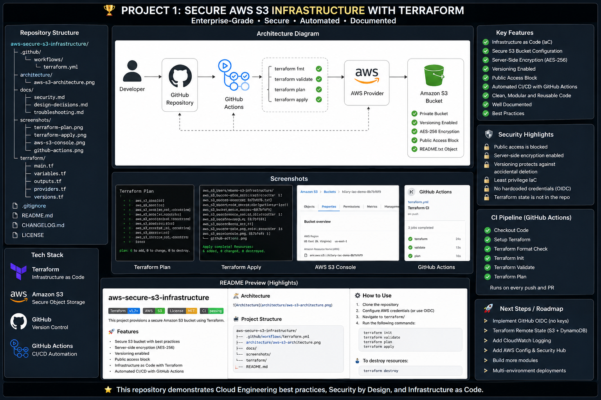

# Secure AWS S3 Infrastructure with Terraform and GitHub Actions

> Provisioning secure AWS infrastructure using Terraform and GitHub Actions.


---

# Project Overview

This repository provisions a secure Amazon S3 bucket using **Terraform** while following AWS security best practices.

The infrastructure is version-controlled with Git, designed to be deployed through GitHub Actions, and managed entirely as Infrastructure as Code (IaC). This approach provides repeatable, auditable, and consistent deployments without relying on manual changes in the AWS Management Console.
## Architecture

The following diagram illustrates the infrastructure deployed by Terraform.

<p align="center">
  
</p>

---
---

# Business Problem

Organizations need secure cloud storage that can be deployed consistently across environments. Manual configuration often leads to configuration drift, inconsistent security settings, and deployment errors.

This project demonstrates how Infrastructure as Code eliminates those issues by provisioning AWS resources through reusable, version-controlled Terraform configuration.

---

# Solution

This solution deploys a secure Amazon S3 bucket with the following controls:

- Private S3 Bucket
- Server-Side Encryption (AES-256)
- Bucket Versioning
- Public Access Block
- README object uploaded automatically
- Infrastructure managed through Terraform

---

## Architecture

The following diagram illustrates the infrastructure deployed by Terraform.

<p align="center">
  

---
## Features

- Infrastructure as Code (Terraform)
- Secure Amazon S3 bucket provisioning
- Server-side encryption (AES-256)
- Public Access Block enabled
- Bucket Versioning enabled
- Automated resource naming
- Modular Terraform configuration
- GitHub Actions CI/CD ready
- AWS security best practices
# Security Controls

| Control | Status |
|----------|:------:|
| Private S3 Bucket | ✅ |
| Public Access Block | ✅ |
| Server-Side Encryption | ✅ |
| Bucket Versioning | ✅ |
| Infrastructure as Code | ✅ |
| Provider Version Locking | ✅ |

---

# Technologies

- Terraform
- AWS S3
- AWS IAM
- AWS CLI
- Git
- GitHub
- GitHub Actions

---

# Repository Structure

```text
.
├── .github/
│   └── workflows/
├── architecture/
├── docs/
├── screenshots/
├── terraform/
│   ├── main.tf
│   ├── variables.tf
│   ├── outputs.tf
│   └── .terraform.lock.hcl
├── .gitignore
└── README.md
```

---

# Deployment Workflow

```text
Developer
    │
    ▼
Terraform CLI
    │
    ▼
AWS Provider
    │
    ▼
AWS Account
    │
    ▼
Amazon S3 Bucket
```

---

# Terraform Workflow

```bash
terraform init
terraform validate
terraform plan
terraform apply
terraform destroy
```

---

# Skills Demonstrated

- Infrastructure as Code (IaC)
- AWS Cloud Security
- Secure Amazon S3 Configuration
- Terraform State Management
- Git Version Control
- Infrastructure Automation
- Cloud Resource Provisioning
- CI/CD Foundations

---
## Lessons Learned

This project strengthened my understanding of:

- Infrastructure as Code (IaC) using Terraform
- AWS S3 security best practices
- AWS IAM authentication
- Git version control
- Technical documentation
- Repeatable cloud infrastructure deployments

---


# Future Enhancements

- GitHub Actions CI/CD Pipeline
- Remote Terraform State
- DynamoDB State Locking
- GitHub OIDC Authentication
- Terraform Modules
- Multi-Environment Deployments
- Security Scanning
- Policy as Code

---

# Author

**Hilary Pemamboh**

Cloud Security Engineer